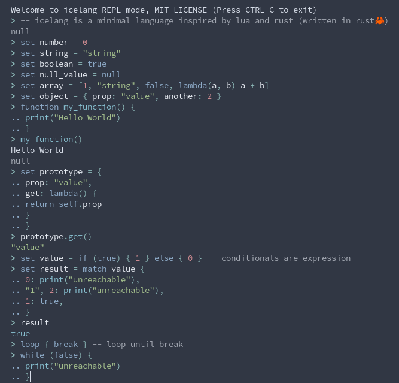

# Icelang

## Description

Icelang is a minimal, dynamically-typed scripting language inspired by Lua and Rust. It is my first attempt at writing a tree-walking interpreter and also my first Rust project. As you might expect, it was not intended for serious use. It is not fast or efficient, but it is decent enough for basic computation.

Check out the [website](https://luckasranarison.github.io/icelang/) for more details about the language specifications. Icelang is also available online through a Web Assembly port of the interpreter, try it now [here](https://luckasranarison.github.io/icelang#playground).

## Preview

See [examples](./examples/) to see some of the features in action.



## Usage

Download icelang from [release](https://github.com/luckasRanarison/icelang/releases/) or [build](##Build) it from source.

```bash
icelang # no arguments for REPL mode
icelang script.ic # to run a file
```

## Build

**NB: You must have the rust tool chain installed.**

### Icelang executable

To build the icelang executable you have to clone the repository then enter the following commands:

```bash
cargo install --path . # install dependencies
cargo build --release
```

### Website and WASM binaries

To build the website you must have npm and wasm-pack installed.

```bash
cargo install --path . # install dependencies
cd wasm/
wasm-pack build --target web --out-dir ../website/pkg # build the wasm binaries
cd ../website/
npm install # install dependencies
npm run build # vite build
```

You can run `npm run dev` to start a local server at https://localhot:5173

## Testing

You can run the tests by running:

```bash
cargo test --workspace --lib
```

## Todo

Some add-ons not directly related to the project itself:

-   [x] WASM Playground

-   [ ] Vscode semantic highlight extension

-   [ ] Bytecode interpreter

-   [ ] Language server and Vscode client
